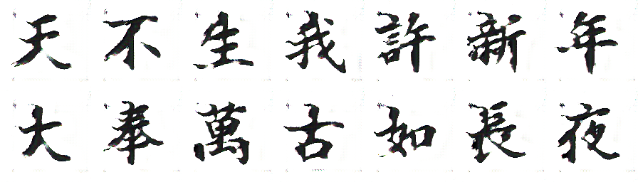

# Generating Chinese Calligraphy Using Neural Networks

Generating Chinese calligraphy using CycleGANs.



## Dependencies:

```
python 3.9.13
jupyter / ipython

opencv 4.6.0
numpy 1.23.4
matplotlib 3.6.1
tensorflow 2.10.0
pickle 0.7.5
pillow 9.2.0
tqdm 4.64.1
```

Plus their dependencies.

Can use tensorflow-cpu and directML.

Generally, the latest version of the modules should work. Python should be 3.9.

## Running

**Data Generation.** Lanting and Simkai are provided. To generatoe more datasets, run the `loader.py` file with arguments `<font path> <out folder> [resolution=128] [characters]`. Characters are given by the constant `PRESETCHARACTERS` if not otherwise specified.

**Training.** Training is done by running `main.py`. Edit the `setup` reion to set paths and domain.

The GAN has many parameters: all the loss parameters are either keras loss keyword strings, or loss functions. The generator type is determined by the Enum `GenType` (in model.py)

Then just run the file.

**Testing/Manual Use.** Manual interaction in `predict.ipynb`, run all the files manually, it should walk you through. Images are saved in `images/` with a `.png` extension.

More automatic generation is done in `analysis.ipynb`, any automatically saved images will be done in `images/genRuns/` prefixed with their model number.
